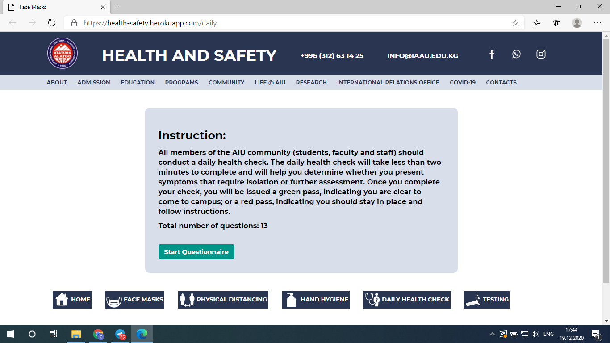
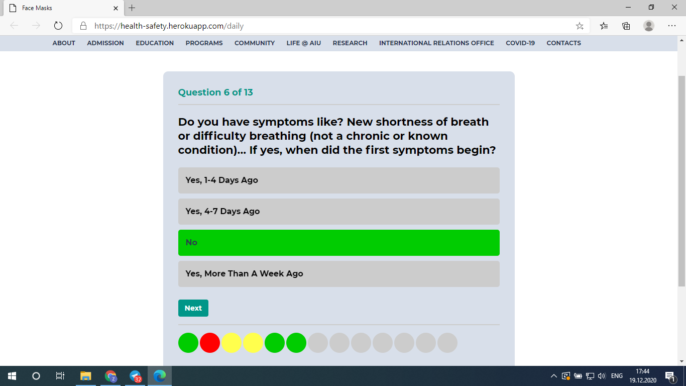
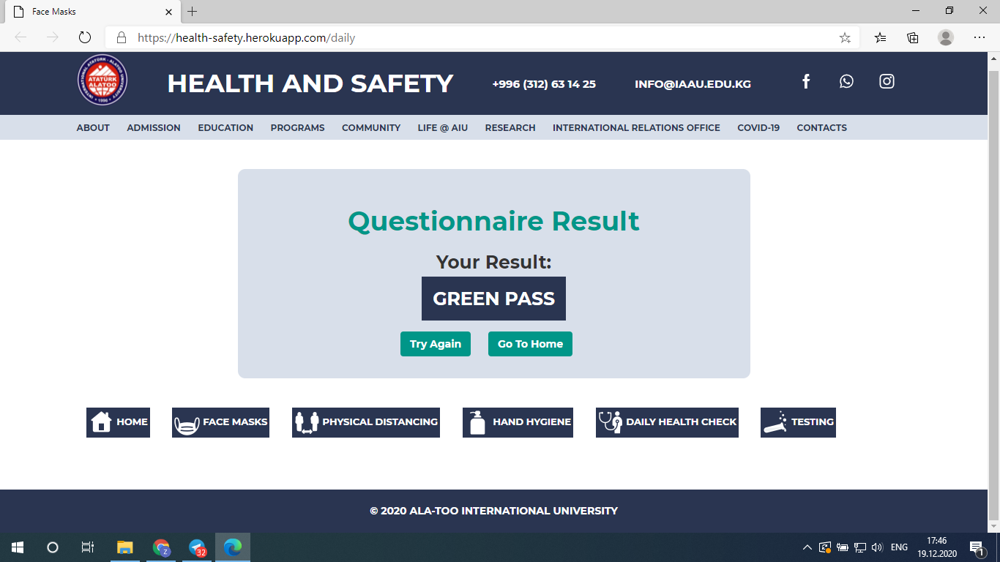
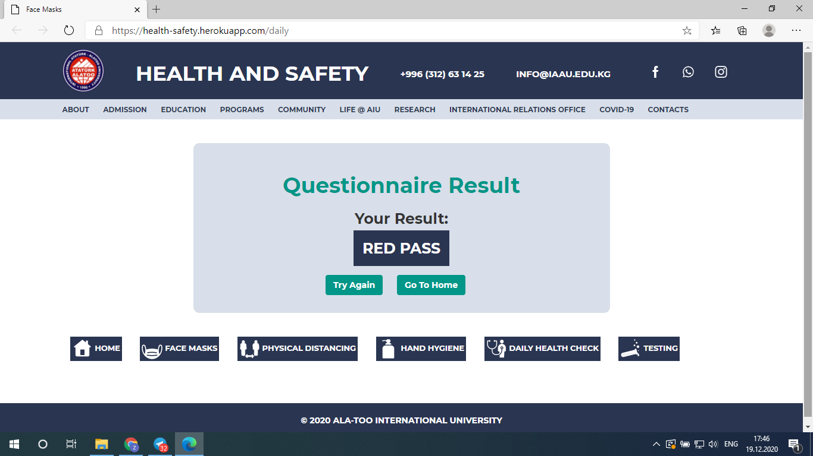

# HEALTH & SAFETY
<i>Was created by Dastan Kadyrov and Altynbek kyzy Zhainagul</i>
<h6></h6>
<i>Some parts of articles in this app was taken from <a href="https://www.who.int/">www.who.int</a> and <a href="https://www.cdc.gov/">cdc.gov</a></i>
<h6></h6>

The presentation of our project on you tube: 

<b> •• <a href="https://youtu.be/EvStviqp_TU">VIDEO</a> ••</b>
<h6></h6>

<a href="https://health-safety.herokuapp.com/">HEALTH and SAFETY</a> is an app that helps people during offline studies in this pandemic situation. With the help of things that are written here and with the help of the tool <a href="https://health-safety.herokuapp.com/daily">DAILY HEALTH CHECK</a> you can release the risk of get infected with covid-19 or get sick.

An app <a href="https://health-safety.herokuapp.com/">HEALTH and SAFETY</a> was created and designed based on <a href="http://alatoo.edu.kg/">AIU's</a> official page. It can be added to a navigator COVID-19, which is located in <a href="http://alatoo.edu.kg/">Ala-Too's</a> official page as a sub-navigator.

When you click to the sub-navigator <a href="https://health-safety.herokuapp.com/">HEALTH and SAFETY</a> there will appeare the home page of an app

<h2><b>1. Header</b></h2>

Part of the MAIN page, where the title of the page, contact informations and share links are located.

<h2><b>2. Navigator</b></h2>

Navigator is designed as same as in official AIU page. It helps you to easily reach to other main sections of an official page.

<h2><b>3. Slider</b></h2>

This is the part of the page, where some images are given in order to have the short image of an overall app.

<h2><b>4. Links</b></h2>

Here is located the main part of the MAIN page. With the help off links there you can easily and faster reach to other pages of an app.

<h4><b><a href="https://health-safety.herokuapp.com/"> • HOME</a></b></h4>

HOME page is the MAIN page of the web site. It looks the same with the MAIN page.

<h4><b><a href="https://health-safety.herokuapp.com/face-masks"> • FACE MASKS,</a><a href="https://health-safety.herokuapp.com/physical-distancing"> PHYSICAL DISTANCING,</a><a href="https://health-safety.herokuapp.com/hand-hygiene"> HAND HYGIENE,</a><a href="https://health-safety.herokuapp.com/testing"> TESTING,</a></b></h4>

This 4 pages have the same skelaton and do the same function. They all have the same header and the same navigator at the top of the windows.

 After them there is located a video,paragraphs that give informations about that special section which is different in every part: (Face Masks, Physical Distancing, Hand Hygiene, Testing, Daily Health Check). Every single paragraph gives some useful information, that releases the risk of get infected with covid-19, if you follow them.

After paragraphs there is located links as in MAIN page of an app, which makes to reach other sections and saves your time.
At the bottom of the pages located the footer.

Here is a screenshot of a section <a href="https://health-safety.herokuapp.com/face-masks">FACE MASKS</a> as an example to all this:

<h4><b><a href="https://health-safety.herokuapp.com/daily-health-check"> • DAILY HEALTH CHECK</a></b></h4>

This section is the same as other sections of an app. The only difference is that it does not contain an informative video.

<h2><b>5. Texts</b></h2>

This is the part of the MAIN page, where general information about other parts of an app and a little about an app itself are given.Every paragraph contains the title and the text.

<h2><b>6. Daily Health Check Tool</b></h2>

This button will bring you to the most important part of an app, where you can check your daily health condition. And you should do it daily before coming to the campus during offline studies. Here is given several questions, and after your answers to that questions based on your answers the system will give you red, green or yellow pass as a result. The meaning of this all pass results and other additional information you can check in <a>Daily Health Check</a> section.

When you enter to the page there will be instructions about a questionnaire.

Then, you should fill that questionnaire.

You will receive a GREEN, YELLOW, or RED pass,according to your answers. 

<b> • GREEN:</b>

Those who do not exhibit any symptoms and who have not been in close contact with someone who has been diagnosed with COVID. You are cleared to be on campus to attend classes, work, and other activities. (Note: This does not change your current job arrangement—only return to campus when advised by your supervisor to do so.)

<b> • YELLOW:</b>

Those who exhibit secondary symptoms (e.g., unexplained new sore throat, headache, body aches, etc.)

<b> • RED:</b>

Those who indicate they are exhibiting one of the big three symptoms (fever greater than 100.4, shortness of breath, or loss of sense of taste or smell).

<h2><b>7. Footer</b></h2>

Footer of the page is a part where written a sentence that this page belongs to AIU.

Generally, an app was created to be helpfull to the community.

<h2><b>FEEDBACKS:</b></h2>

<video controls><source src="final/img_readme/distance.mp4" type="video/mp4"></video>

