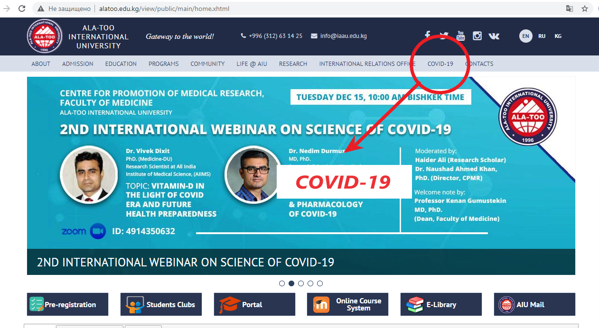
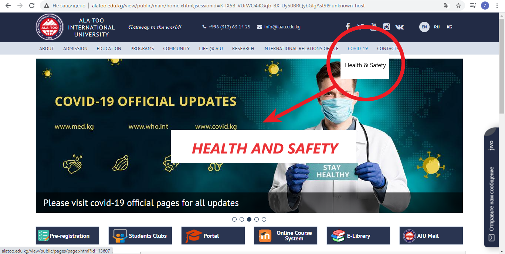
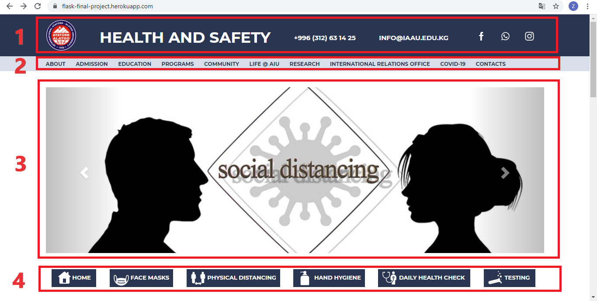
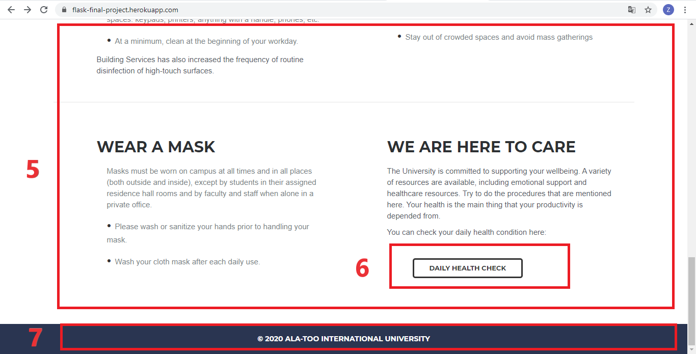
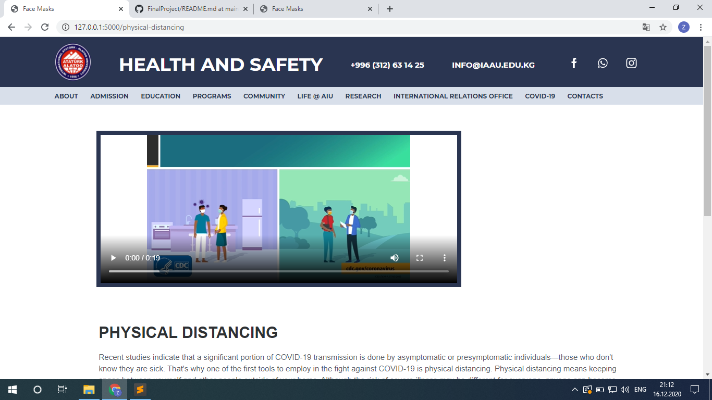
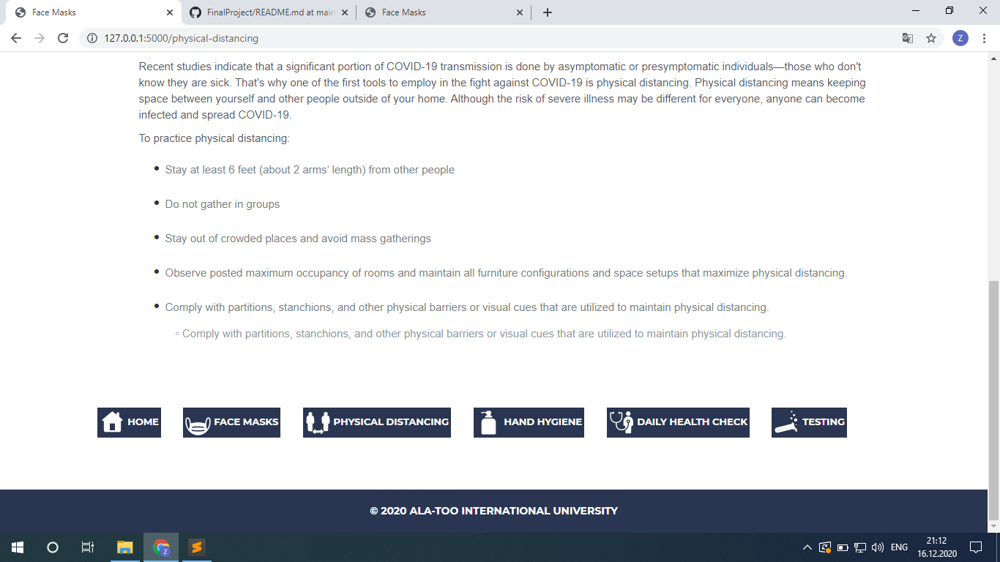

# HEALTH & SAFETY
<i>Was created by Dastan Kadyrov and Altynbek kyzy Zhainagul</i>
<h6></h6>
<i>Some parts of articles in this app was taken from <a href="https://www.who.int/">www.who.int</a> and <a href="https://www.cdc.gov/">cdc.gov</a></i>
<h6></h6>
<b> Here will be a video </b>
<h6></h6>

<a href="https://flask-final-project.herokuapp.com/">HEALTH and SAFETY</a> is an app that helps people during offline studies in this pandemic situation. With the help of things that are written here and with the help of the tool <a href="https://flask-final-project.herokuapp.com/daily">DAILY HEALTH CHECK</a> you can release the risk of get infected with covid-19 or get sick.

An app <a href="https://flask-final-project.herokuapp.com/">HEALTH and SAFETY</a> was created and designed based on <a href="http://alatoo.edu.kg/">AIU's</a> official page. It can be added to a navigator COVID-19, which is located in <a href="http://alatoo.edu.kg/">Ala-Too's</a> official page as a sub-navigator.

When you click to the sub-navigator <a href="https://flask-final-project.herokuapp.com/">HEALTH and SAFETY</a> there will appeare the home page of an app

<h2><b>1. Header</b></h2>

Part of the MAIN page, where the title of the page, contact informations and share links are located.

<h2><b>2. Navigator</b></h2>

Navigator is designed as same as in official AIU page. It helps you to easily reach to other main sections of an official page.

<h2><b>3. Slider</b></h2>

This is the part of the page, where some images are given in order to have the short image of an overall app.

<h2><b>4. Links</b></h2>

Here is located the main part of the MAIN page. With the help off links there you can easily and faster reach to other pages of an app.

<h4><b><a href="https://flask-final-project.herokuapp.com/#"> - HOME</a></b></h4>

HOME page is the MAIN page of the web site. It looks the same with the MAIN page.

<h4><b><a href="https://flask-final-project.herokuapp.com/#"> - FACE MASKS,</a><a href="https://flask-final-project.herokuapp.com/physical-distancing"> PHYSICAL DISTANCING,</a><a href="https://flask-final-project.herokuapp.com/hand-hygiene"> HAND HYGIENE,</a><a href="https://flask-final-project.herokuapp.com/testing"> TESTING,</a></b></h4>

This 4 pages have the same skelaton and do the same function. They all have the same header and the same navigator at the top of the windows.

 After them there is located a video,paragraphs that give informations about that special section which is different in every part: (Face Masks, Physical Distancing, Hand Hygiene, Testing, Daily Health Check). Every single paragraph gives some useful information, that releases the risk of get infected with covid-19, if you follow them.

After paragraphs there is located links as in MAIN page of an app, which makes to reach other sections and saves your time.
At the bottom of the pages located the footer.

Here is a screenshot of a section <a href="https://flask-final-project.herokuapp.com/physical-distancing">FACE MASKS</a> as an example to all this:

<h4><b><a href="https://flask-final-project.herokuapp.com/#"> - DAILY HEALTH CHECK</a></b></h4>

This section is the same as other sections of an app. The only difference is that it does not contain an informative video.

<h2><b>5. Texts</b></h2>

